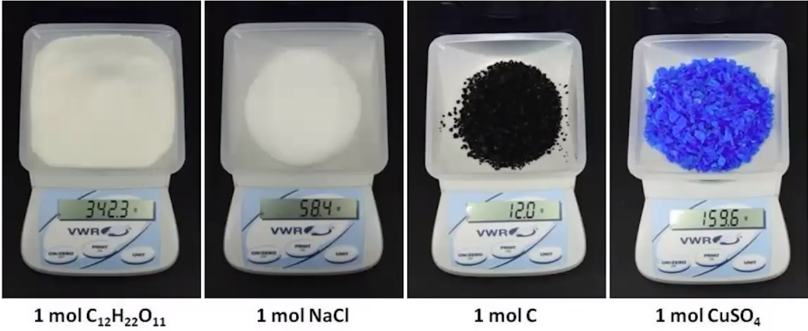

# Daily Video 1 Notes

## Moles and Molar Mass

- Moles: Particles can not be counted or measured directly via mass, so we use mass in Chemistry for mass calculation.
- 
  - $6.02^{*} 10^{23}$ is the number of things in a mole, hence all 4 samples contain **one mole** of particles.

- While the samples all contain the same number of particles, the mass of each sample is different. Why? **Because the constituent particles in each sample are different.**
  - constituent particles is the simplest & smallest unit through which any substance is made.

- 

 
